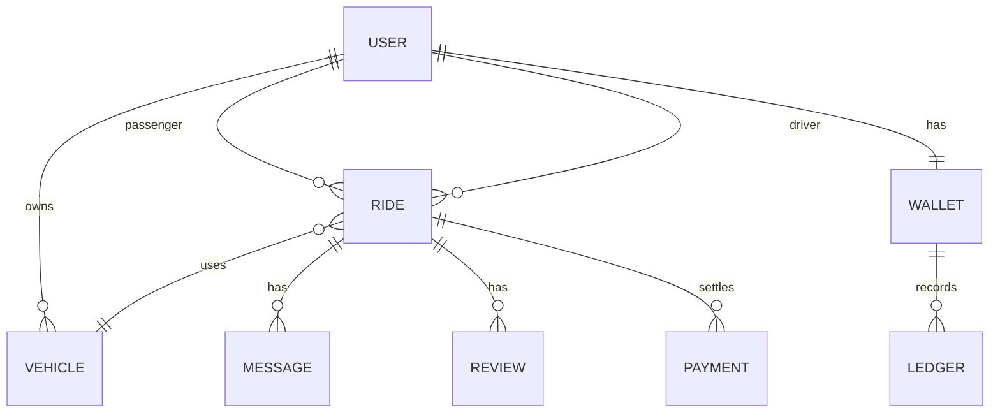

# Production architecture — carpool / ride-sharing platform

This document maps **requirements → architecture**, extends the current **Expo + Express + MongoDB** codebase, and lists **planned APIs and schemas**. Implement features incrementally behind feature flags to avoid breaking existing flows.

---

## 1. Current stack (baseline)

| Layer | Technology |
|-------|------------|
| Mobile | React Native (Expo SDK ~54), Redux Toolkit, Axios, i18n RTL |
| API | Node.js + Express (modular routes under `backend/src/routes/`) |
| DB | MongoDB + Mongoose (`backend/src/models/`) |
| Auth | JWT (`Authorization: Bearer`), bcrypt password hashing |
| Admin web | Static UI under `/admin-ui/` from the same API process |

**Already in code:** `helmet`, global + auth `express-rate-limit` on the API (see `backend/src/middleware/rateLimiters.js`).

---

## 2. Target folder structure

```
ReachNative Car/
├── docs/
│   └── PRODUCTION_ARCHITECTURE.md    ← this file
├── backend/
│   ├── src/
│   │   ├── index.js
│   │   ├── config/
│   │   ├── routes/
│   │   ├── controllers/             ← optional: thin controllers, routes stay slim
│   │   ├── services/                ← business logic (matching, pricing, payouts)
│   │   ├── middleware/
│   │   ├── models/
│   │   ├── jobs/                    ← cron: reminders, recurring rides
│   │   ├── websocket/               ← Socket.io namespaces (driver/passenger rooms)
│   │   └── integrations/            ← Stripe, Twilio, FCM, Google Maps
│   └── admin-web/
├── mobile/
│   ├── src/
│   │   ├── api/
│   │   ├── store/
│   │   ├── screens/
│   │   ├── navigation/
│   │   ├── components/
│   │   ├── hooks/
│   │   └── services/                ← push token, background location (policy)
│   └── app.config.js
└── admin-dashboard/                 ← optional: separate Vite/React app for heavy analytics
```

**Principle:** **MVC-style modular monolith** first; split services (payments, notifications) when load requires it.

---

## 3. Database design (MongoDB collections + indexes)

> You asked for PostgreSQL *or* MongoDB. The project already uses **MongoDB**. Below is a **document model**; a **Postgres** equivalent would use normalized tables with the same relations.

### 3.1 Core entities

| Collection | Purpose | Key fields & indexes |
|------------|---------|----------------------|
| **users** | Auth profile + roles | `email` **unique**, `phone` **sparse unique**, `role`, `status` (`pending`/`active`/`blocked`), `approvalRequestedAt`, `ratingsAvg`, `walletBalance` |
| **sessions** or **refresh_tokens** | Refresh rotation | `userId`, `tokenHash`, `expiresAt`, `revokedAt`; TTL index on `expiresAt` |
| **otp_codes** | Email/SMS OTP | `channel`, `target`, `codeHash`, `expiresAt`; TTL index |
| **vehicles** | Driver vehicles | `driverId`, `type`, `plate`, `seats`, `isActive`; compound `{ driverId: 1, isActive: 1 }` |
| **rides** | Offer / request / match | `status`, `passengerId`, `driverId`, `vehicleId`, `pickup/destination` (GeoJSON), `scheduledFor`, `recurrenceRuleId`, `fare`, `createdAt` — **2dsphere** on pickup; compound `{ status: 1, scheduledFor: 1 }` |
| **ride_offers** or **bookings** | Many-to-one match attempts | `rideId`, `userId`, `state` |
| **wallets** + **ledger** | Double-entry | `userId`, `currency`; ledger lines: `type`, `amount`, `ref` (rideId, stripeId) |
| **payments** | External provider | `provider` (`stripe`/`cash`), `status`, `rideId`, `idempotencyKey` **unique** |
| **reviews** | Mutual ratings | `rideId` **unique compound** with `fromRole`, `toUserId`; prevent duplicate |
| **messages** | Chat (existing `Message` model can extend) | `rideId`, `senderId`, `text`, `createdAt`; compound `{ rideId: 1, createdAt: 1 }` |
| **notifications** | In-app + push payload | `userId`, `payload`, `readAt`, `createdAt` |
| **reports** | Abuse | `reporterId`, `targetUserId`, `rideId`, `reason` |

### 3.2 ER-style overview (Mermaid)



---

## 4. REST API surface

### 4.1 Implemented today (representative)

| Method | Path | Notes |
|--------|------|--------|
| GET | `/health` | DB heartbeat |
| POST | `/auth/register` | Rate-limited |
| POST | `/auth/login` | Rate-limited |
| GET | `/auth/me` | JWT |
| PATCH | `/auth/profile` | JWT |
| … | `/rides/*`, `/driver/*`, `/passenger/*`, `/admin/*`, `/vehicles/*` | See `README.md` |

### 4.2 Recommended additions (production modules)

**Auth & security**

| Method | Path | Description |
|--------|------|-------------|
| POST | `/auth/refresh` | Rotate refresh token |
| POST | `/auth/logout` | Revoke refresh |
| POST | `/auth/otp/request` | Email/SMS OTP |
| POST | `/auth/otp/verify` | Verify + bind channel |
| POST | `/admin/users/:id/approve` | Admin activation |

**Matching & rides**

| Method | Path | Description |
|--------|------|-------------|
| GET | `/rides/matches` | Proximity + destination similarity + time window |
| POST | `/rides/schedule` | Future / recurring (links `recurrenceRule`) |

**Payments**

| Method | Path | Description |
|--------|------|-------------|
| POST | `/payments/intents` | Stripe PaymentIntent |
| POST | `/payments/webhook` | Stripe webhook (raw body) |
| GET | `/wallet` | Balance + ledger |

**Reviews**

| Method | Path | Description |
|--------|------|-------------|
| POST | `/reviews` | After ride `completed`, idempotent per pair |

**Realtime**

| WS | `/socket` | Namespace `ride:{id}` — driver location, ETA, status |

Use **Socket.io** (same Node process or separate adapter with Redis for horizontal scale).

---

## 5. Key implementation patterns

### 5.1 JWT access + refresh (sketch)

- Short-lived **access token** (15m) in `Authorization` header.
- **Refresh token** HTTP-only cookie or secure storage on mobile + `POST /auth/refresh`.
- Store **hash** of refresh token in DB; rotate on each refresh; revoke on logout.

### 5.2 OTP (email/SMS)

- Store **hashed** OTP + expiry; max N tries per hour (rate limit + lockout).
- Integrations: **Twilio** / **AWS SNS** / **Firebase Auth** (phone).

### 5.3 Matching algorithm (v1)

1. Geo query: drivers/passengers within **R km** (Mongo `$near` / `$geoNear`).
2. Score: destination **Haversine** or **Google Routes API** distance + **time overlap** + **vehicle seats** ≥ passengers.
3. Return ranked list; optional **batch job** every minute for scheduled rides.

### 5.4 Payments

- **Stripe**: PaymentIntent + webhook idempotency + ledger entries.
- **Cash**: mark `collected` by driver with passenger confirm or grace period.

### 5.5 Push notifications

- **Firebase Cloud Messaging** (Expo push works with EAS / FCM credentials).
- Events: ride accepted, driver arriving, message received, payment settled.

---

## 6. Frontend screen map (Expo)

| Flow | Screens |
|------|---------|
| Onboarding | Splash → carousel → permission prompts |
| Auth | Login, Register, OTP verify, Pending approval |
| Passenger | Home map, Request ride, Scheduled rides, Matches list |
| Driver | Go online, Offers inbox, Active ride, Earnings |
| Shared | Ride detail, Live tracking, Chat, Call (deep link Twilio/agora) |
| Account | Profile, Wallet, Payment methods, Reviews |
| Admin | Web dashboard (existing `/admin-ui/` + richer SPA optional) |

Use **design tokens** (you already have theme) + **React Navigation** typed routes.

---

## 7. Scaling & deployment

| Concern | Approach |
|---------|----------|
| API instances | Horizontal scale behind **load balancer**; sticky sessions **not** required if JWT stateless + Redis adapter for Socket.io |
| DB | MongoDB **Atlas** with replica set; indexes as above |
| Cache | **Redis**: sessions, rate limits, socket adapter, near-driver caches |
| Files | **S3** / GCS for profile images |
| Secrets | **Vault** / cloud secret manager; never commit `.env` |
| CI/CD | GitHub Actions: lint → test → build mobile (EAS) → deploy API (Docker/Kubernetes) |
| Observability | OpenTelemetry + structured logs; metrics on `/health` variants |

---

## 8. Phased rollout (recommended)

1. **Phase A — Security baseline:** refresh tokens, admin approval flags, OTP stubs, tighten CORS origins.
2. **Phase B — Realtime:** Socket.io + driver ping + ETA from Directions API.
3. **Phase C — Payments:** Stripe sandbox + wallet ledger.
4. **Phase D — Matching v2 + scheduling:** geo indexes + cron jobs.
5. **Phase E — Notifications & polish:** FCM, abuse reporting, analytics.

---

## 9. References in this repo

- Auth hashing: `backend/src/routes/auth.js` (bcrypt).
- JWT middleware: `backend/src/middleware/auth.js`.
- Rate limits: `backend/src/middleware/rateLimiters.js`.
- API mount order + helmet: `backend/src/index.js`.

For questions about prioritizing phases vs. your launch date, treat **auth hardening + realtime + payments** as the critical path for a credible production MVP.
