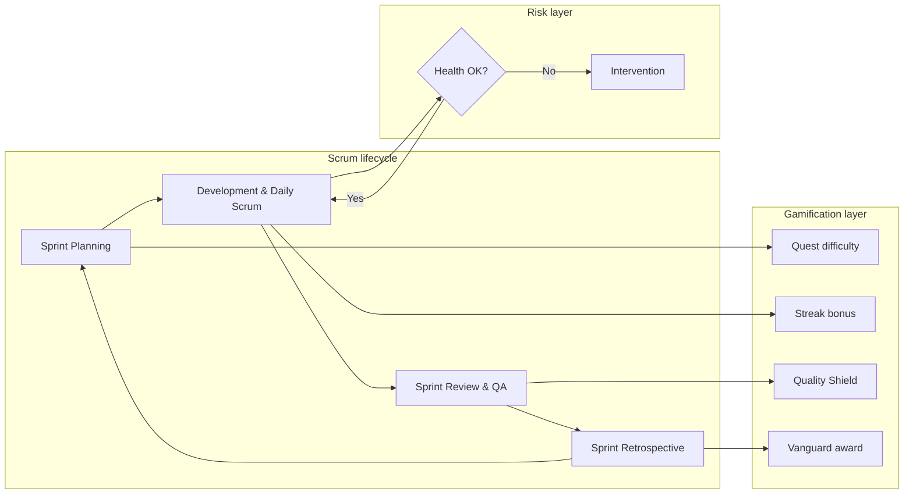
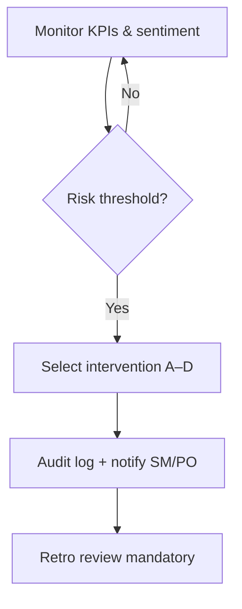
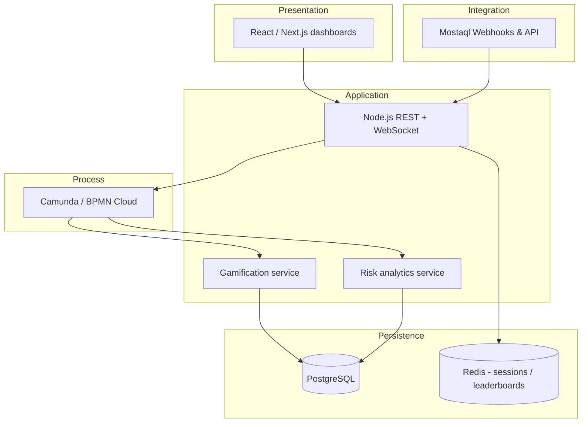

# BPMN-Based Agile Workflow Optimization for Freelancing Platforms

## Scrum Framework with Gamification & Risk Management on Mostaql

**Arab Academy for Science, Technology & Maritime Transport (AASTMT)**  
**Graduation Project Documentation — 2026**

| | |
|---|---|
| **Presented by** | Youssef Mohamed Salah · Ahmed Yahya · Omar Hamed |
| **Supervisor** | Dr. Walied |
| **Version** | 2.1 (diagrams embedded) |

---

## Table of Contents

1. [Executive Summary](#1-executive-summary)  
2. [Introduction](#2-introduction)  
3. [Problem Statement](#3-problem-statement)  
4. [Research Questions & Objectives](#4-research-questions--objectives)  
5. [Literature & Theoretical Foundation](#5-literature--theoretical-foundation)  
6. [Scrum Framework (Enhanced)](#6-scrum-framework-enhanced)  
7. [Gamification System Design](#7-gamification-system-design)  
8. [Gamification Risks](#8-gamification-risks)  
9. [Risk Management Strategy](#9-risk-management-strategy)  
10. [Stakeholder Analysis](#10-stakeholder-analysis)  
11. [BPMN Workflow Model](#11-bpmn-workflow-model)  
12. [Key Features & Platform Integration](#12-key-features--platform-integration)  
13. [Benefits & Success Metrics](#13-benefits--success-metrics)  
14. [Technical Architecture](#14-technical-architecture)  
15. [Implementation Roadmap](#15-implementation-roadmap)  
16. [Future Enhancements](#16-future-enhancements)  
17. [Conclusion](#17-conclusion)  
18. [References](#18-references)  

---

## 1. Executive Summary

This graduation project proposes a **BPMN-orchestrated** integration of **Agile Scrum** with **ethical gamification** tailored to the **Mostaql** freelancing ecosystem. Distributed software teams on freelance platforms often suffer from weak process visibility, uneven motivation, and ad-hoc “points and leaderboards” that increase output short-term but damage collaboration long-term.

Our contribution is threefold:

1. **Process layer** — Standard Scrum events (Planning → Development → Review → Retrospective) modeled as executable BPMN with role-based swimlanes (Product Owner, Scrum Master, Developer).
2. **Engagement layer** — Points, badges, and sprint-scoped leaderboards mapped to Scrum artifacts using **Self-Determination Theory (SDT)** (autonomy, competence, relatedness).
3. **Governance layer** — A dedicated **Risk Management swimlane** that monitors burnout signals, toxic competition, and reward addiction, triggering automated or human-in-the-loop interventions.

The framework is designed to be **scalable**, **auditable** (BPMN), and **human-centric** (risk overrides). It transforms freelancing workflows from transactional task completion into a transparent, measurable, and sustainable high-performance journey—without sacrificing developer well-being.

---

## 2. Introduction

### 2.1 The Agile Evolution

The software industry has adopted iterative delivery to respond to changing requirements. **Scrum** structures this flexibility through defined **roles**, **events**, and **artifacts**, enabling predictable delivery cadence in uncertain environments.

### 2.2 Engagement on Freelancing Platforms

Platforms such as **Mostaql** decentralize talent but rarely replicate the social cohesion of co-located teams. **Gamification**—applying game-design elements in non-game contexts—can restore feedback loops, recognition, and progression when implemented with clear rules and ethical guardrails.

| Indicator | Reported impact (literature & industry benchmarks) |
|-----------|---------------------------------------------------|
| Productivity in well-designed gamified teams | Up to **~15%** uplift (context-dependent) |
| Retention / engagement for remote contributors | Up to **~80%** improvement in some platform studies |

*Note: Figures are illustrative drivers for design goals; empirical validation on Mostaql is part of the recommended pilot phase (Section 15).*

### 2.3 Scope

- **In scope:** Scrum lifecycle on Mostaql projects, gamification mechanics, BPMN automation, risk interventions, stakeholder dashboards.  
- **Out of scope (v1):** Full Mostaql product rewrite; legal/compliance audit of platform ToS; non-software freelance categories.

---

## 3. Problem Statement

Traditional freelance project management exhibits the **Visibility Gap**: developers see tasks but not mission, quality expectations, or team health—leading to **motivation decay** and silent disengagement.

Parallel attempts at gamification often fail because they:

- Optimize **individual rankings** over **collective outcomes**;
- Ignore **difficulty weighting** (easy tasks farmed for points);
- Create **surveillance anxiety** via permanent public leaderboards;
- Trigger the **over-justification effect** (external rewards replace intrinsic motivation).

> *“Teams are told that adding a leaderboard makes everyone an Avengers-level squad—until one contributor burns out chasing the ‘Employee of the Sprint’ badge.”*

Without a **structured risk-mitigation layer**, gamification becomes a liability. This project treats engagement and safety as **co-equal** design constraints.

---

## 4. Research Questions & Objectives

### 4.1 Research Questions

| # | Question |
|---|----------|
| RQ1 | How can BPMN orchestration reduce administrative overhead between Scrum events on a freelancing platform? |
| RQ2 | Which gamification mechanics improve velocity and quality without increasing toxic competition? |
| RQ3 | Which measurable signals best predict burnout or “system gaming” in distributed Scrum teams? |
| RQ4 | How should automated interventions balance fairness, privacy, and process compliance? |

### 4.2 Objectives

| ID | Objective | Success criterion (pilot) |
|----|-----------|---------------------------|
| O1 | **Performance optimization** — BPMN triggers between Scrum events | ≥20% reduction in manual status updates (PO/SM survey) |
| O2 | **Ethical gamification** — Fair Play scoring (effort × difficulty × peer quality) | Gini coefficient of sprint points below agreed threshold |
| O3 | **Radical transparency** — Unified health + velocity dashboard | PO and Dev access to same sprint metrics within 24h |
| O4 | **Risk mitigation** — Automated interventions for addiction / fatigue | Documented intervention log; zero unresolved critical alerts >48h |

---

## 5. Literature & Theoretical Foundation

| Concept | Application in this framework |
|---------|--------------------------------|
| **Scrum Guide** (roles, events, artifacts) | Baseline process swimlane |
| **BPMN 2.0** | Executable workflow, gateways, message flows |
| **Self-Determination Theory (Deci & Ryan)** | Quest choice (autonomy), levels (competence), team badges (relatedness) |
| **Over-justification effect** | Risk lane + intrinsic-motivation prompts in Retro |
| **Fair Play / anti-cheat** | Weighted points, sprint reset leaderboards, SM review |

---

## 6. Scrum Framework (Enhanced)

The lifecycle follows standard Scrum, with **BPMN gateways** enforcing transitions on Mostaql.

| Phase | Scrum event | Platform artifact | Gamification trigger |
|-------|-------------|-------------------|----------------------|
| 1 | **Sprint Planning** | Sprint Backlog | Story points → **Quest difficulty** multiplier |
| 2 | **Development & Daily Scrum** | Tasks / daily notes | **Streak bonus** for consistent updates (capped) |
| 3 | **Sprint Review & QA** | Deliverables / acceptance | **Quality Shield** badge for low-defect delivery |
| 4 | **Sprint Retrospective** | Improvement actions | **Vanguard of Change** for implemented process fixes |



---

## 7. Gamification System Design

### 7.1 Mechanics (MADE)

| Mechanic | Description | Anti-abuse rule |
|----------|-------------|----------------|
| **Points** | Currency of completed, reviewed work | Weighted by difficulty + QA score |
| **Badges** | Mastery markers (e.g. Code Ninja, Architect, Team Catalyst) | Evidence-based unlock (not volume-only) |
| **Leaderboards** | Sprint rankings | **Reset each sprint**; optional anonymized mode |
| **Quests** | Tasks framed as objectives | PO assigns critical path flags |

### 7.2 Dynamics & SDT mapping

| SDT need | Design element |
|----------|----------------|
| **Autonomy** | Developers choose quests within sprint commitment |
| **Competence** | Levels, skill trees, personal velocity trends |
| **Relatedness** | Team badges, pair-review bonuses, Retro collective goals |

### 7.3 Fair Play algorithm (conceptual)

```
sprint_points = base_points × difficulty_factor × quality_factor × collaboration_bonus
```

- `difficulty_factor` — derived from planning poker / PO weight  
- `quality_factor` — post-review defect density, rework rate  
- `collaboration_bonus` — peer recognition cap per sprint (prevents collusion loops)

---

## 8. Gamification Risks

| Risk | Description | Leading indicator |
|------|-------------|-------------------|
| **Over-justification** | Work only when rewards visible | Drop in off-sprint contributions |
| **Ethical gaming** | Easy tasks prioritized | Low critical-path completion % |
| **Toxic rivalry** | Hoarding knowledge, negative reviews | Sentiment drop in comments |
| **Surveillance stress** | Fear of leaderboard ranking | Reduced experimentation / spike in WIP |
| **Burnout** | Unsustainable streak chasing | After-hours commits, missed Retro |

---

## 9. Risk Management Strategy

The **Risk Management swimlane** supervises gamification and can **override** mechanics.

| Intervention | Trigger | Action |
|--------------|---------|--------|
| **A — Leaderboard dampening** | Top/bottom point gap > threshold (e.g. 3×) | Hide individual ranks; show team percentile bands |
| **B — Team bonding** | Toxic keywords / flagged reviews | Mandatory SM-facilitated session; pause streak bonuses |
| **C — Reward cooldown** | Streak > N days + declining quality | Freeze multipliers; intrinsic-motivation Retro prompt |
| **D — Workload cap** | Hours / commits exceed policy | Block new quest assignment until PO acknowledgment |



**Principle:** Safety overrides speed. No badge is worth a burned-out contributor.

---

## 10. Stakeholder Analysis

| Role | Responsibility | Gamification role |
|------|----------------|-------------------|
| **Product Owner** | Value, backlog, acceptance | Defines quests, ROI alignment of rewards |
| **Scrum Master** | Process, impediments, ethics | **Game Master** + risk interventions |
| **Developer** | Increment delivery | **Player** — autonomy within sprint goal |
| **Platform (Mostaql)** | Projects, payments, APIs | Hosts webhooks, identity, audit trail |

**Collaboration matrix:** High-frequency PO ↔ SM sync ensures **game balance** (reward economy vs. business goals).

---

## 11. BPMN Workflow Model

### 11.1 Swimlanes

| Lane | Responsibility |
|------|----------------|
| **Product Owner** | Backlog, acceptance, quest definition |
| **Scrum Master** | Ceremonies, impediments, risk response |
| **Developer** | Implementation, daily updates |
| **Gamification engine** | Points, badges, leaderboard updates |
| **Risk supervisor** | Threshold checks, interventions |

### 11.2 BPMN elements used

| Element | Purpose |
|---------|---------|
| **Pools / swimlanes** | Role and domain separation |
| **Exclusive gateways (XOR)** | Work complete? Reward eligible? Risk breach? |
| **Parallel gateways (AND)** | Notify game engine + risk monitor on task done |
| **Sequence flows** | Scrum path: Planning → Dev → Review → Retro |
| **Message flows** | Cross-lane: task events → points; alerts → SM |

*Visual infographic:* attach high-resolution BPMN diagram as **Figure 1** in the PDF export (original project asset).

### 11.3 Example gateway logic (pseudocode)

```
ON task_completed:
  IF acceptance_tests_pass AND peer_review_approved:
    EMIT message_to(gamification, "award_points")
  PARALLEL:
    EMIT message_to(risk, "evaluate_sprint_health")
```

---

## 12. Key Features & Platform Integration

| Feature | Description |
|---------|-------------|
| **BPMN automation** | State transitions via workflow engine (e.g. Camunda) |
| **Real-time analytics** | Velocity, defect rate, engagement, risk score |
| **Mostaql API / webhooks** | Task lifecycle sync, project metadata |
| **Audit trail** | Immutable log of points and interventions |
| **Role-based dashboards** | PO: value & health; Dev: personal growth; SM: process & risk |

---

## 13. Benefits & Success Metrics

### 13.1 For freelancers

- Faster feedback and visible progression (badges, levels)  
- Clearer expectations via quest framing  
- Protection from overwork via risk monitoring  

### 13.2 For clients / Mostaql

- Higher predictable velocity  
- Quality incentives tied to acceptance, not volume  
- Transparent project health for dispute reduction  

### 13.3 KPI dashboard (recommended)

| KPI | Target direction |
|-----|------------------|
| Sprint velocity (story points) | Stable or improving |
| Escaped defects / sprint | Decreasing |
| Sprint participation (Daily Scrum) | ≥90% |
| Risk interventions / sprint | Low but non-zero (system active) |
| Developer satisfaction (survey) | ≥4/5 |

---

## 14. Technical Architecture



| Layer | Technology | Rationale |
|-------|------------|-----------|
| Frontend | React / Next.js | Rich dashboards, SSR for PO reports |
| Workflow | Camunda BPMN Cloud | Standards-based, visual models |
| Backend | Node.js | Async I/O for webhooks |
| Database | PostgreSQL | Relational integrity for audits |
| Cache | Redis | Sprint leaderboard TTL |
| Integration | Mostaql webhooks | Event-driven task sync |

### 14.1 Security & privacy

- Pseudonymized leaderboards option  
- PO/SM-only access to risk alerts with PII  
- GDPR-aligned data retention on sentiment logs  

---

## 15. Implementation Roadmap

| Phase | Duration | Deliverables |
|-------|----------|--------------|
| **P0 — Model** | 4 weeks | BPMN diagrams, Fair Play spec, risk thresholds |
| **P1 — MVP** | 8 weeks | Webhooks, points, sprint leaderboard, SM dashboard |
| **P2 — Risk lane** | 6 weeks | Interventions A–D, audit log, Retro integration |
| **P3 — Pilot** | 8 weeks | 2–3 live Mostaql teams, KPI report |
| **P4 — Hardening** | 4 weeks | Performance, security review, documentation |

---

## 16. Future Enhancements

| Enhancement | Description |
|-------------|-------------|
| **AI-driven balancing** | LLM sentiment on chat (with consent) to tune reward multipliers |
| **Social gamification** | Cross-team friendly challenges, mentorship quests |
| **Predictive burnout** | ML on commit/time patterns (transparent to user) |
| **Client-facing health score** | Aggregated, non-surveillance metrics for trust |

---

## 17. Conclusion

Integrating **Scrum with ethical gamification** is not a productivity shortcut—it is a redesign of how distributed teams coordinate, recognize, and protect one another. **BPMN** makes the process **explicit and improvable**; the **Risk Management swimlane** ensures engagement never trades off well-being for badges.

On platforms like **Mostaql**, the balanced framework delivers:

- **Push** — structure, metrics, and delivery discipline  
- **Pull** — autonomy, mastery, and belonging  

> *Innovation is iterative; engagement is essential—but sustainability is non-negotiable.*

---

## 18. References

1. Schwaber, K. & Sutherland, J. *The Scrum Guide.*  
2. Object Management Group. *BPMN 2.0 Specification.*  
3. Deci, E. L. & Ryan, R. M. Self-Determination Theory.  
4. Deterding, S. et al. Gamification: Toward a Definition. *CHI 2011.*  
5. Hamari, J. et al. Does Gamification Work? — A Literature Review.  
6. Mostaql Platform Documentation (API & project model).  
7. Camunda. *BPMN Workflow Engine Documentation.*

---

## Appendix A — Glossary

| Term | Definition |
|------|------------|
| **Quest** | Gamified user story / task with difficulty weight |
| **Fair Play** | Scoring algorithm balancing effort, difficulty, quality |
| **Visibility Gap** | Disconnect between task list and project mission |
| **Risk swimlane** | BPMN lane for health and intervention logic |

---

## Appendix B — Document changelog

| Version | Change | Rationale |
|---------|--------|-----------|
| 2.0 | Research questions, Fair Play, tables, roadmap | Academic rigor |
| 2.1 | **Embedded diagram PNGs** (Figures 1–3) | Printable BPMN / architecture visuals |

---

© 2026 Arab Academy for Science, Technology & Maritime Transport. All rights reserved.  
Designed by Youssef Mohamed Salah, Ahmed Yahya, and Omar Hamed.  
*Documentation v2.1 — revised for submission.*
